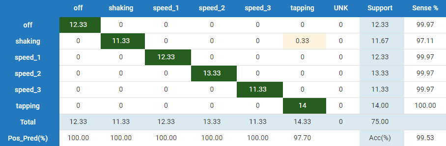

# MIGRATED
# This repository is no longer maintained; this project has been moved [here](https://github.com/microchip-pic-avr-examples/avr128da48-curiosity-sensiml-fan-monitoring-mplab-mcc).
#
#

# Fan Condition Monitoring with SensiML
|  |
| :--: |
| Deployed fan condition monitor |

## Repository Overview
This repository is a companion to the [Fan Condition Monitoring with SensiML
tutorial](http://microchip.wikidot.com/machine-learning:fan-condition-monitoring-with-sensiml)
on the Microchip Developer website. It contains the firmware to classify the operational state of a Honeywell HT-900 fan including whether the fan is on, what speed it's running at, and whether the fan is experiencing one of a handful of fault conditions (*tapping*, *shaking*, *unknown*). The demo project runs on the [AVR Curiosity Nano](https://www.microchip.com/developmenttools/ProductDetails/EV45Y33A) with the Bosch BMI160 ([Mikroe IMU2 click board](https://www.mikroe.com/6dof-imu-2-click)) or TDK ICM42688 ([Mikroe IMU14 click board](https://www.mikroe.com/6dof-imu-14-click)) sensors.

The fan states that the model can recognize (shown in the video above) are summarized below:

* *Unknown*
* *Fan Off*
* *Tapping*
* *Fan Speed 1*
* *Fan Speed 2*
* *Fan Speed 3*
* *Shaking*

## Hardware Used
* AVR128DA48 Curiosity Nano Evaluation Kit [(DM164151)](https://www.microchip.com/Developmenttools/ProductDetails/DM164151)
* Curiosity Nano Base for Click boards™ [(AC164162)](https://www.microchip.com/developmenttools/ProductDetails/AC164162)
* IMU 2 click board (https://www.mikroe.com/6dof-imu-2-click)
* IMU 14 click board (https://www.mikroe.com/6dof-imu-14-click)

## Software Used
* MPLAB® X IDE (https://microchip.com/mplab/mplab-x-ide)
* MPLAB® XC8 compiler (https://microchip.com/mplab/compilers)
* MPLAB® Code Configurator (https://www.microchip.com/mcc)

# Data Collection
The dataset used for the development of this application consists of 6-axis IMU recordings taken with the AVR Curiosity Nano + Curiosity Nano Base mounted to the housing of a Honeywell HT-900 fan. For further description of the application setup, see the article for this demo on the [Microchip Developer website](http://microchip.wikidot.com/machine-learning:avr-fan-condition-monitoring-with-sensiml).

Head to the [releases page](../../releases) to download the fan condition dataset. Data samples are stored as csv files and can be imported into SensiML's [Data Capture Lab](https://sensiml.com/documentation/data-capture-lab/index.html) en masse using the included DCLI descriptor file. Visit the the SensiML DCLI documentation page [here](https://sensiml.com/documentation/data-capture-lab/importing-external-sensor-data.html#dcli-format-and-pre-labeled-data) for import instructions.

## Data Collection Firmware
A binary build of the data logging firmware used in the data collection for this project can be downloaded from the [releases page](../../releases); to build data logging firmware for different sensor configurations, visit the [ml-avrda-cnano-imu-data-logger](https://github.com/MicrochipTech/ml-avrda-cnano-imu-data-logger) repository.

## Sensor Configuration
The sensor configuration used in this demo is summarized in the table below. These settings can be changed by modifying app_config.h.

| IMU Sensor | Axes | Sampling Rate | Accelerometer Range | Gyrometer Range |
| --- | --- | --- | --- | --- |
| Bosch BMI160 | Ax, Ay, Az, Gx, Gy, Gz | 100Hz | 2G | 125DPS |

# Firwmare Operation
The firmware will reflect the state of operation of the demo using the onboard LEDs; this behavior is summarized in the table below.

| State | LED Behavior | Description |
| --- | --- | --- |
| Fan Off |	LED0 on |	Fan is not running. |
| Fan Speed 1/2/3 |	LED0 low/med/high speed blinking |	Fan is running normally. |
| Shaking |	LED0 fast blink	| Detected fan shaking. |
| Tapping/Unknown |	LED0 turbo blink	| Detected tapping or other abnormal behavior. |
| Firmware error | LED0 off |	Fatal error. (Do you have the correct sensor plugged in?). |
| Buffer overflow |	LED0 lit for 5 seconds | Processing is not able to keep up with real-time; data buffer has been reset. |

In addition, the firmware also prints the classification output for each inference over the UART port. To read the UART port output, use a terminal emulator of your choice (e.g., PuTTY) with the following settings:

- Baudrate 115200
- Data bits 8
- Stop bits 1
- Parity None

The terminal output should look similar to the figure shown below.

|  |
| :--: |
| UART Terminal Output |

Note that the output classification is given as an integer number which corresponds to the class ID; the class ID to class label mapping is described in the table below.

| Class ID | Class Name |
| --- | --- |
| 0 | *Unknown* |
| 1 | *Fan Off* |
| 2 | *Shaking* |
| 3 | *Fan Speed 1* |
| 4 | *Fan Speed 2* |
| 5 | *Fan Speed 3* |
| 6 | *Tapping* |

## Usage with SensiML Open Gateway
The firmware UART output can be visualized with the SensiML [Open Gateway application](https://github.com/sensiml/open-gateway):

1. Open a terminal and change to the directory where you've checked out this repository.
2. Clone the open-gateway repository and install the dependencies:
    > `git clone https://github.com/sensiml/open-gateway`\
    > `pip install -r open-gateway/requirements.txt`
3. Change the baudrate (`BAUD_RATE` variable) in `open-gateway/config.py` to 115200
4. Change to the open-gateway directory and run the open-gateway application, passing in the fan demo's model.json description file:
   > `cd open-gateway`\
   > `python app.py -m firmware/knowledgepack/libsensiml/model.json`
5. Connect to the Curiosity Nano in the gateway application:
   * Select the `Recognition` device mode.
   * Select `Serial` connection type, and enter the UART address (e.g. COM4) in the `Device ID` field.
   * Click `Connect To Device`.
6. Switch to the `Test Mode` tab and click `Start Stream`.

## Firmware Benchmark
Measured with the BMI160 sensor configuration, ``-O2`` level compiler optimizations, and 4MHz clock
- 30kB Flash
- 2.6kB RAM
- 24ms Inference time (average)

## Classifier Performance
Below is the confusion matrix result for the classifier evaluated on the entire ht-900 fan condition dataset.

